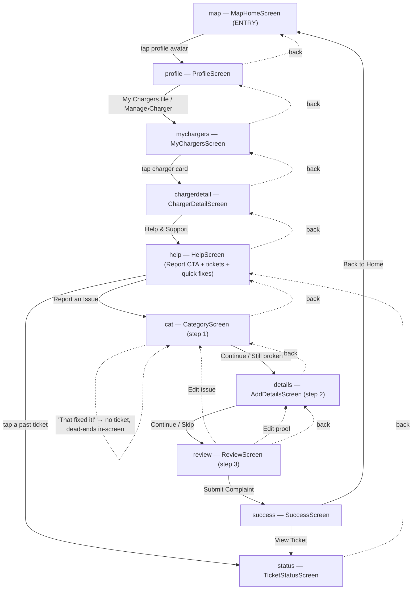
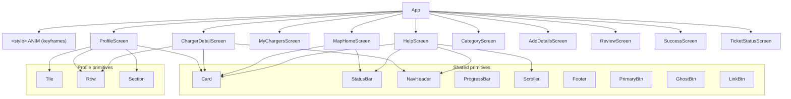

# Kazam Ticketing Prototype — Project Map

> Auto-reference so the codebase doesn't need re-reading each session.
> **Everything lives in one file:** [`src/App.jsx`](src/App.jsx) (~877 lines). Keep this map in sync when that file changes.

---

## 1. What it is

An interactive **mobile prototype** for the Kazam EV-charger issue-reporting flow. React 19 + Vite 6, no router, no backend — all state is in-memory, all data is hardcoded. Renders a single 390×844 "phone frame" centered on a beige page, auto-scaled to the viewport. It **boots on the real-app Map Home** and walks the actual navigation path into the report flow.

## 2. Run / build

```bash
npm run dev        # vite dev server, auto-opens http://localhost:5173
npm run build      # → dist/
npm run preview    # serve the built dist/ locally
```
`node_modules` is already installed. Vite config ([vite.config.js](vite.config.js)) only adds the React plugin + `server.open`.

## 3. File tree

```
.
├── index.html          # Vite entry; mounts #root, loads /src/main.jsx
├── vite.config.js      # react() plugin + server.open
├── src/
│   ├── main.jsx        # React root — <StrictMode><App/></StrictMode>  (9 lines)
│   └── App.jsx         # ENTIRE prototype: tokens, data, primitives, 10 screens, App router
├── package.json        # scripts + deps (react 19, vite 6)
├── README.md
└── PROJECT_MAP.md      # ← this file
```

## 4. Tech stack & conventions

- **React 19** function components + hooks (`useState`, `useEffect`, `useRef`). No router, no Redux, no CSS files.
- **Styling = inline styles** keyed off the `T` design-token object. The *only* CSS is one injected `<style>{ANIM}</style>` block holding `@keyframes` + `:active`/scrollbar rules (inline styles can't express those).
- **Icons = emoji** throughout (consistent with the original prototype). Charger photos are faux gradient boxes with a 🔌 glyph; the map is a stylized CSS background, not real tiles.
- **`KazamLogo`** (defined just before `MapHomeScreen`) renders the official logo PNG at [`src/assets/kazam-logo.png`](src/assets/kazam-logo.png) via `` — used on the map pin, the floating brand button, and charger markers. `size` prop = height; width auto-scales. The PNG is the single source for the brand mark — replace that file to update the logo everywhere.
- **Inter font** is injected at runtime via a `<link>` appended to `<head>` in `App`'s effect.
- **No real I/O**: voice recording is a fake 4-second timer; photo is a boolean toggle; "submit" just navigates. All data is the `CHARGER`/`USER`/`CATS`/`QUICK_FIXES`/`TICKETS` constants.

## 5. Navigation flow (state machine)

`App` holds `screen` state and swaps screens with `go(screen, back?)`. `back` flips the slide animation direction. The `<div key={screen}>` remounts on every change so the slide animation replays. **Boots on `map`.**

The first 5 screens replicate the real Kazam app path to reach issue-reporting:
**Map Home → (profile avatar) → Profile → My Chargers → Charger detail → Help & Support.**
Help & Support then leads into the original report flow.



## 6. Component tree



## 7. Screen reference

| `screen` | Component | Def line | Props | Local state | Purpose |
|----------|-----------|----------|-------|-------------|---------|
| `map` | `MapHomeScreen` | [552](src/App.jsx#L552) | `onProfile` | — | **Entry.** Faux map, search bar, filter chips, pin/user dot, promo banner, Nearby Chargers sheet, Scan-QR FAB, bottom nav. Profile avatar → profile |
| `profile` | `ProfileScreen` | [646](src/App.jsx#L646) | `onBack`, `onMyChargers` | — | Account screen: profile card, Refer&Earn, 2×2 grid, Manage/Actions/Resources/Legal sections, logout. "My Chargers" → mychargers |
| `mychargers` | `MyChargersScreen` | [727](src/App.jsx#L727) | `onBack`, `onCharger` | — | "My Chargers (1)" list — one charger card → chargerdetail; purple + FAB |
| `chargerdetail` | `ChargerDetailScreen` | [752](src/App.jsx#L752) | `onBack`, `onHelp` | — | Charger hero + stats + Manage rows + **Help & Support** CTA → help |
| `help` | `HelpScreen` | [156](src/App.jsx#L156) | `onBack`, `onReport`, `onTicket` | — | Help & Support landing: Report-an-Issue CTA, Past Tickets, Quick Fixes (was the old Home) |
| `cat` | `CategoryScreen` | [218](src/App.jsx#L218) | `onBack`, `onNext` | `sel`, `fixedIt` | Pick issue category; "Try First" fix panel; self-heal dead-end |
| `details` | `AddDetailsScreen` | [289](src/App.jsx#L289) | `onBack`, `onNext` | `voice`, `secs`, `photo`, `note` | Add proof: fake voice note / photo toggle / text note |
| `review` | `ReviewScreen` | [360](src/App.jsx#L360) | `catId`, `proof`, `onBack`, `onSubmit`, `onEditCat`, `onEditProof` | — | Summary rows + "after you submit" card |
| `success` | `SuccessScreen` | [409](src/App.jsx#L409) | `onHome`, `onView` | — | Animated checkmark, ticket `IN-880731`, next steps |
| `status` | `TicketStatusScreen` | [452](src/App.jsx#L452) | `ticket`, `onBack` | `msgs`, `reply` | Status pill, vertical timeline, chat thread + reply box |

**Profile primitives** ([525–550](src/App.jsx#L525)): `Tile` (grid square), `Row` (list item w/ optional `badge`/`last`), `Section` (purple-bar header + Card).

## 8. App-level state ([App](src/App.jsx#L803))

| State | Purpose |
|-------|---------|
| `screen` | Active screen (the 10 keys above). **Initial: `'map'`** |
| `dir` | `'fwd'` / `'back'` — picks `kzSlideIn` vs `kzSlideBack` |
| `catId` | Selected category id, flows into `review` + `newTicket` |
| `proof` | Proof label string (or `null`), shown in `review` |
| `viewTicket` | Ticket object passed to `status` (a past ticket or `newTicket`) |
| `scale` | Phone-frame scale to fit viewport (clamped 0.55–1, recalced on resize) |
| `guideOn` | Whether the guided-tour coach bubble is shown (default `true`; toggled by Hide / the `?` button) |

`newTicket` is built fresh from `catId` so "View Ticket" after submit shows a just-created in-progress ticket. `go(s, back)` sets direction + screen.

## 9. Data model ([lines 33–87](src/App.jsx#L33))

- `CHARGER` `{ id:'e1sdhk', name:'Smile Stone 1', loc:'Nagar, Pune', addr }` — the one charger used across My Chargers → detail → Help → Review, so the whole flow is consistent.
- `USER` `{ name:'Harsh', email, phone, initial:'H' }` — shown on the Profile screen. `USERNAME = USER.name`.
- `CATS[]` `{ id, icon, label, fix }` — 6 issue categories. `fix` is `{ title, steps[] }` or `null` (burnt/other have no self-fix → skip "Try First").
- `QUICK_FIXES[]` — 3 tip strings on the Help screen.
- `TICKETS[]` `{ id, catId, label, status, age, timeline[], messages[] }` — 2 seed tickets (`in-progress` `IN-661721`, `resolved` `IN-596637`).
- `getCat(id)` ([87](src/App.jsx#L87)) — `CATS.find` helper.

## 10. Design tokens & animations ([lines 4–31](src/App.jsx#L4))

- **`T`** — palette: dark surfaces, borders, `green` (resolved/available/success), `blue` (in-progress/user-dot), `amber` (warn / Help CTA), `red` (Kazam logo / recording), **`purple`/`purpleDim`** (Kazam brand accent — FABs, profile, badges), `text`/`muted`/`dim`.
- **`ANIM`** keyframes: `kzSlideIn`/`kzSlideBack` (screen transitions), `kzFadeUp`, `kzPop`, `kzBlink`, `kzGlow`, `kzPulse`. Plus `.kz-press` (tap scale-down) and `.kz-scroll` (hidden scrollbars).
- Page background behind the phone frame is beige `#EDE4D3` (set in `body` style + outer wrapper div in `App`).

## 11. Guided tour

A click-through coaching overlay drives a demo viewer through the flow. Defined just before `App`:
- **`GUIDE`** — `screen → { n, title, text, pos, arrow? }`. One entry per screen (10 steps). `pos` places the bubble inside the frame; `arrow:'up'` adds a pointer (used on `map` → the profile avatar).
- **`CoachBubble`** — the purple step bubble (STEP n OF 10 + title + text + Hide).
- **`Guide`** — full-frame overlay (`pointerEvents:'none'`, so the highlighted control stays tappable). Shows the bubble when `on`, else a `?` re-show button (bottom-left).

Rendered in `App` as a sibling of the keyed screen `<div>`, inside the frame (which now has `position:'relative'`). `Hide` sets `guideOn=false`; the `?` button restores it. To re-word a step, edit its `GUIDE` entry; bubbles are click-through so exact positioning isn't critical.

## 12. Gotchas / notes

- **Single source of truth is [src/App.jsx](src/App.jsx)** — adding a screen means: add a component, add a `screen === '…'` branch in `App`'s render, and wire `go(...)` callbacks.
- The lead-in screens (map/profile/mychargers/chargerdetail) are mostly **non-functional except the path to Help** — only the profile avatar, the "My Chargers" tile/row, the charger card, and the Help & Support CTA navigate; other rows/FABs are inert by design.
- `MapHomeScreen` uses absolute-positioned overlays on a faux gradient map; `MyChargersScreen`/`ChargerDetailScreen` use `position:relative` roots so their FABs anchor correctly.
- The ticket number after submit (`IN-880731`) is hardcoded in both `SuccessScreen` and `newTicket`.
- "That fixed it!" path intentionally has no forward nav — it's a success dead-end.
- To restyle globally, edit `T`; to add motion, add a keyframe to `ANIM` and reference it via inline `animation:`.
